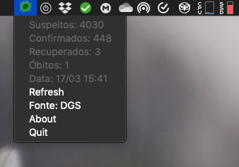

# 🦠 CoronaBar
   

**🎊 UPDATE!** Coronabar is now available for Ubuntu as a snap installable package!

*Get information about current cases of [coronavirus](https://en.wikipedia.org/wiki/2019%E2%80%9320_coronavirus_pandemic) right from the menu bar. Just in case you want to add stress to your life.*

## What?

A simple app that sits on your menu bar, that allows you to get informed on the cases of coronavirus in different countries. It also updates every 30 mins. 

  

## How to download?
### MacOS
**[➡️ DOWNLOAD HERE](https://github.com/duarteocarmo/coronabar/releases/latest/download/CoronaBar.zip)**

*⚠️ Mac users, remember to [right click, or ctrl+click](https://support.apple.com/en-us/HT207700) after unzipping and hitting "open". If you are having problems see [this link](https://support.apple.com/en-us/HT202491). ⚠️*

### Linux 

`sudo snap install coronabar`

*Note: Depends on gnome, might not be available on all distros, tested on ubuntu.*

Thanks to the amazing [lapisdecor](https://github.com/lapisdecor) for the port 😊!
## Where does the data come from? 

Thanks a lot to [this repo](https://github.com/javieraviles/covidAPI) for providing an API!

Information comes originally from [worldometer](https://www.worldometers.info/coronavirus/). 

## How?
Python 3 and [rumps](https://rumps.readthedocs.io/en/latest/index.html).

❤️🐍

## Why? 

Why not? 🤷

## About me

[Duarte O.Carmo](https://duarteocarmo.com)
