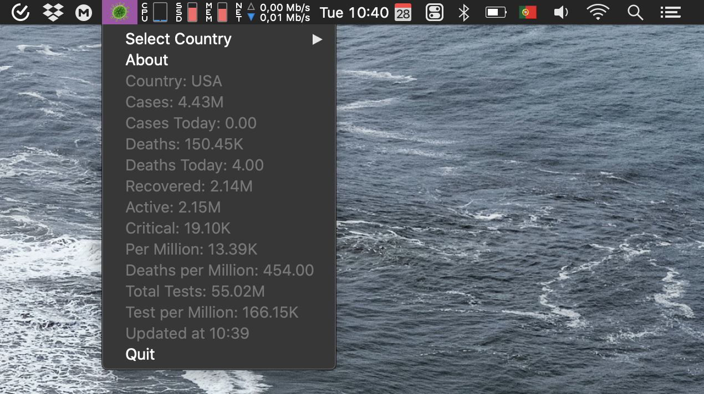

# 🇵🇹🦠 Corona Bar

*Fica informado quanto aos casos de [coronavírus](https://en.wikipedia.org/wiki/2019%E2%80%9320_coronavirus_pandemic) em Portugal a partir da tua menu bar. Só na eventualidade de quereres acrescentar  stress á tua vida.*

## O quê? 

Uma aplicação simples para a tua menu bar, que mostra alguns números  importantes relativo aos casos de [coronavírus](https://en.wikipedia.org/wiki/2019%E2%80%9320_coronavirus_pandemic) em Portugal. 

  

## Download

**[➡️ FAZ DOWNLOAD AQUI](https://github.com/duarteocarmo/coronapt/releases/latest/download/Corona_PT.zip)**

*⚠️ Utilizadores de mac devem abrir a aplicação  com um [right click, ou ctrl+click](https://support.apple.com/en-us/HT207700) ⚠️*

*Nota: Mac Only - Se quiserem desenvolver para Windows - feel free to [pull request](https://github.com/duarteocarmo/coronapt/pulls)!*

## De onde vem a informação? 

A informação vem diretamente  do [site da Direção Geral da Saúde (DGS)](https://www.dgs.pt/). Se quiseres saber que API estou a consumir, o url está [neste script](app.py).

## Como?
App desenvolvida usando python 🐍 e uma framework chamada [rumps](https://rumps.readthedocs.io/en/latest/index.html).

## Porquê? 

Porque não? 🤷

## Sobre mim

[Duarte O.Carmo](https://duartecarmo.com)
